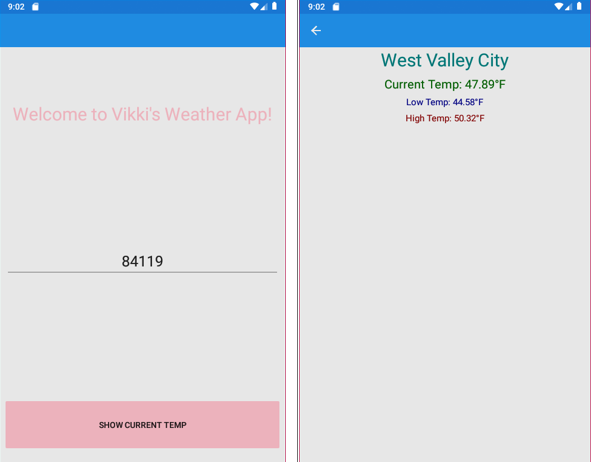

# Open-Weather-App
This is a cross-platform application using Xamarin helping it interact with an API. Used OpenWeatherMap API

INFO 2200 - Computer Programming II

The purpose of this assignment is to help you as a student learn how to build a mobile application that interacts with an Application Program Interface (API). An API is a set of routines, protocols, and tools to help build application software that interacts with a given set of logical rules built by other developers. Most API requires an API key to interact with it so requests are tracked (mainly for security reasons).

OpenWeatherMap is another API that can be used to get the current temperature, weather conditions, and much more of a given city or location.

This project will have you use the OpenWeatherMap API to get the current weather data of a given city by having the user enter in the desired zip code. After the user provides the zip code, the API request will then return all of the weather conditions of that city and display it to the user on the mobile device.

Build a cross-platform application using Xamarin to interact with an API

Gain access to the OpenWeatherMap API by receiving an API key.

Requests will be sent to the OpenWeatherMap API

Responses from the OpenWeatherMap API will be received

The current weather of a given city will be displayed to the user

Results:

